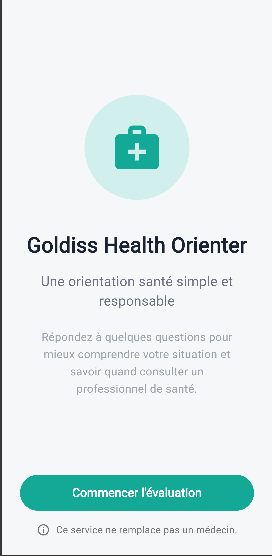
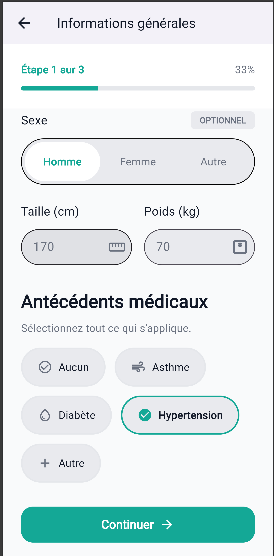
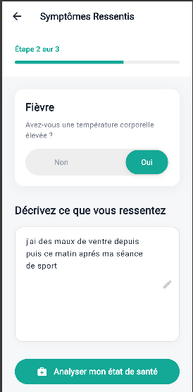
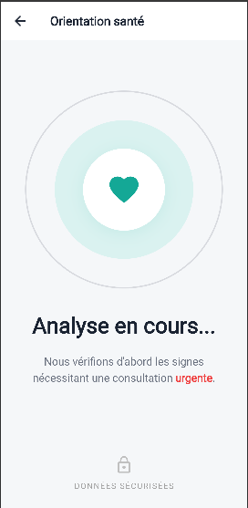
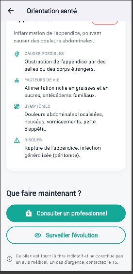

# 🩺 Goldiss Health Orienter

[](https://flutter.dev)
[](https://dart.dev)
[](https://openrouter.ai)
[](LICENSE)

**Goldiss Health Orienter** is a smart decision-support mobile app that helps you understand possible health conditions based on your symptoms and medical history – **always encouraging you to see a real doctor**.

> ⚠️ **Important Disclaimer**  
> This application does **not** provide medical diagnosis. It is designed for informational purposes only and to guide you toward professional healthcare. Always consult a qualified physician.

---

## ✨ Key Features

- 🧬 **Personalized health profile** – Enter your age, height, weight, blood type, and pre‑existing conditions.
- 🤒 **Symptom checker** – Add multiple symptoms from an intuitive list or free text.
- 🤖 **AI‑powered analysis** – The app uses `OpenRouter` API to suggest **3 possible conditions** based on your inputs.
- 📋 **Clear, evidence‑based insights** – Each hypothesis comes with a short explanation and confidence level.
- 🏥 **Consultation prompt** – For each result, you are explicitly advised to consult a doctor and, where possible, find nearby clinics.
- 📴 **Offline‑friendly** – Core symptom data is stored locally; AI analysis requires internet but gracefully handles disconnection.

---

## 🚀 How It Works

1. **Fill your profile** – Basic medical background.
2. **Describe what you feel** – Select or type your symptoms.
3. **Let the AI assist you** – The app sends anonymised data to OpenRouter, which returns 3 possible explanations.
4. **Get educated, then get help** – Read the hypotheses, note the recommendations, and take them to a real doctor.

---

## 🧰 Tech Stack

| Layer | Technology |
| --- | --- |
| Frontend | Flutter 3.x, Dart |
| AI Integration | REST API (OpenRouter, models like GPT‑4o mini) |
| State Management | Provider (or Riverpod – update as needed) |
| Backend Services | Firebase Auth (optional), Firebase Firestore (optional) |
| Tools | VS Code, Android Studio, Git |

---

## 📸 Screenshots

| Onboarding | General Info | Symptom Input |
| --- | --- | --- |
|  |  |  |

| Loading | Results |
| --- | --- |
|  |  |

---

## ▶️ Getting Started

To run the project locally:

```bash
# Clone the repository
git clone https://github.com/joihomisael-dev/goldiss-health-orienter.git
cd goldiss-health-orienter

# Install dependencies
flutter pub get

# Run on a connected device or emulator
flutter run
